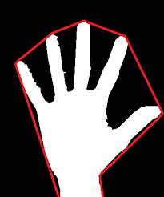
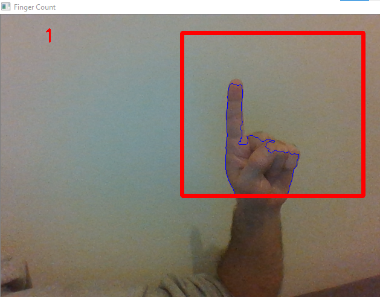
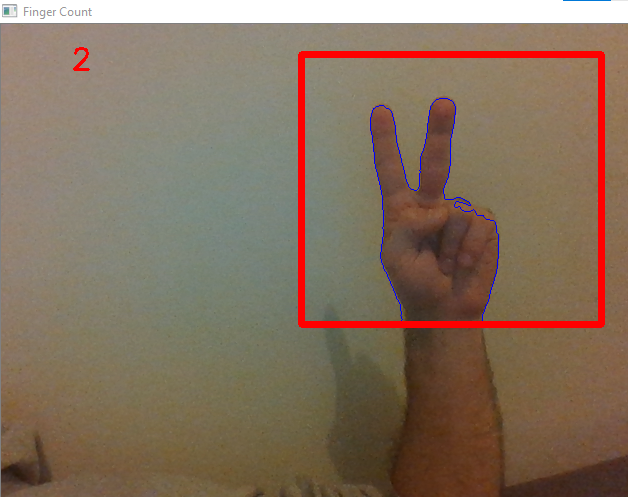
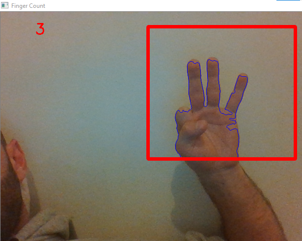
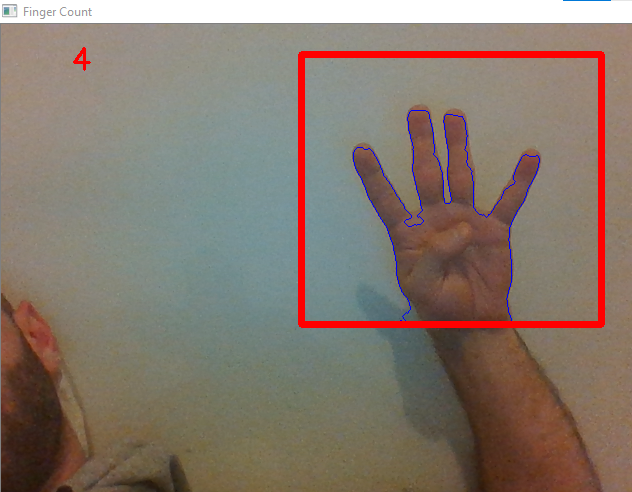
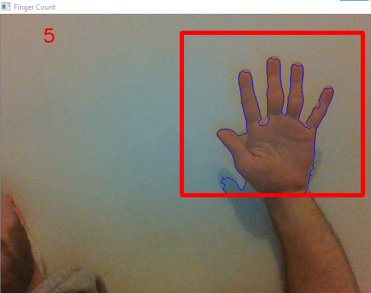

# Counting Fingers using Convex Hull

In this notebook we are using Convex Hull algorithm from OpenCv to count fingers. 
This is a capstone project of the udemy course developed by Jose Portilla.

First of all we choose the region of interest which will be used as a background and where the hand will be positioned. We threshold it so we can grab a foreground. Afterwards when the hand is positioned in the roi, we segment it using convex hull. It looks something like the following

  

After that we find the maximum euclidean distance between the center of the palm and the most extreme points of the convex hull, later it will be used to create a circle with 80% radius of the max euclidean distance between center point and outermost points. And finally we loop through the contours to see if we count any more fingers.

The results are given below. Remark: this method is not robust and quite sensitive to noise, nevertheless it is the simpless method to tackle the subject. 

    

 

